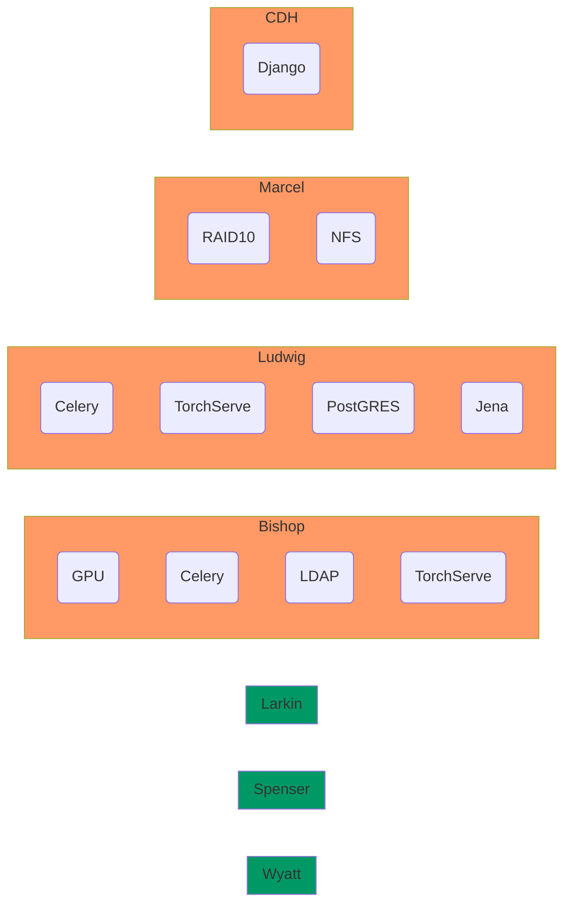

# CDH Domain

This repository contains the code base constituting the framework that handles requests to the cdh.jhu.edu domain.



## Quick start development environment

These instructions assume you have opened a command-line session, e.g. using `Terminal` on OSX, `xterm` on Linux, or `PowerShell` on Windows.  In the latter case, the commands may differ slightly from what's described here, but not in substantial ways.  It might be worthwhile to enable the [Windows Linux Subsystem](https://docs.microsoft.com/en-us/windows/wsl/install) so you can work in `Windows Terminal`, where they should be identical.


The necessary software (beyond what will be installed directly from the command-line) is a recent version of [Python 3](https://www.python.org/downloads/), [Git](https://git-scm.com/downloads), and [NPM](https://nodejs.org/en/download/), each of which has a corresponding lower-case command, so if they are installed you should be able to see usage info by running e.g.:

```
$ npm -h
```

Note that the initial `$` sign indicates it is being run on the command-line.

### Getting the framework and installing libraries

The first step is to clone the code repository, and moving into the newly-created directory:

```
$ git clone https://github.com/comp-int-hum/cdh-domain.git
$ cd cdh-domain
```

The next step is to creating and activating a fresh Python virtual environment:

```
$ python3 -m venv local
$ source local/bin/activate
```

And then, installing all the Python libraries used by the framework, and the utility that will manage Javascript libraries:

```
$ pip install -r development_requirements.txt
$ npm install bower
```

Finally, copying the example settings into place:

```
$ cp cdh/settings.py.example cdh/settings.py
```

### Initializing the framework

At this point, you can start using the standard Django management script.  First, initialize the database with the commands:

```
$ python manage.py makemigrations cdh primary_sources turkle_wrapper topic_modeling image_clustering
$ python manage.py makemigrations
$ python manage.py migrate
$ python manage.py createcachetable
```

Then, create some testing entries in the database with the command:

```
$ python manage.py populate --wipe
```

And collect various static resources:

```
$ python manage.py bower install
$ python manage.py collectstatic
```

Finally, the following command will start the framework:

```
$ python manage.py runserver localhost:8080
```

At this point you should be able to browse to http://localhost:8080 and interact with the site.  Note that it will only be accessible on the local computer and this is by design: it is running without encryption, and using infrastructure that won't scale well and doesn't implement some important functionality.  The `populate` script should have created three users (`user1`, `user2`, etc), each with password `user`.  You should also be able to add new users from the login page: note that, rather than sending a link via email, in development mode the framework will print out information on the command-line where the `runserver` command is running.  You'll probably want to log in as one of these users while developing, so you can see and test your changes/new app/etc.

### Editing code, templates, and settings

The best reference for how everything is organize is probably the [Django documentation](https://docs.djangoproject.com/en/4.0/): the framework is a fairly complex example, but generally tries to follow best practices in those documents.  When you edit code or templates, in most cases the changes will be immediately reflected in the site.  The exceptions to this are when changes are made to the database schema (i.e. when models are added, removed, or modified in the various `models.py` files).  When such changes *have* been made, the local server should be stopped with `<ctrl>-c`, and commands like the following will compute the database changes, apply them, and restart the server:

```
python manage.py makemigrations
python manage.py migrate
python manage.py runserver localhost:8080
```

The file `cdh/settings.py` is the canonical configuration source for the entire framework, and is heavily commented with useful information (comments beginning with `# CDH NOTE:` are specifically relevant).

### Adding a new app to the framework

An important common goal is to add a new app (i.e. another item on the top navigation bar of the site for logged in users).  It's actually a simple process to get the basics in place:

1. Choose your app's simple (lower-case, underscores-instead-of-spaces) and human-readable names (say, `my_great_app` and `My great app`, it's good for them to be obviously related)
2. Copy the dummy project directory to your app's simple name: `cp -prf dummy_app my_great_app`
3. Edit `my_great_app/apps.py` and change `DummyAppConfig` and `dummy_app` to `MyGreatAppConfig` and `my_great_app`, respectively
4. Finally, at the top of `cdh/settings.py`, add `"my_great_app" : "My great app",` to the `CDH_APPS` dictionary

Now, when you browse to http://localhost:8080 as a logged-in user, you should see your app.  It has no content yet, but now you can focus on developing in the `my_great_app/` directory, which is a straightforward minimal Django app and can be treated as such.

## More complex development

At the top of the example settings file there are several options set to `False`:

```
USE_LDAP = False
USE_CELERY = False
USE_POSTGRES = False
USE_JENA = False
USE_TORCHSERVE = False
```

These correspond to servers that the framework does, or will, rely on for key functionality that the development setup "fakes" by default.  LDAP provides user and group management/authentication for the entire CDH infrastructure, Celery provides asynchronous execution of long-running computations like training and applying models, PostGRES is a production SQL database, and Jena provides storage and manipulation of RDF datasets.  In each case, it is possible to start a suitable server on your computer, change the option to `True`, and edit the connection information further down in the settings file to connect it to your development site.  Most importantly, you will need to install either [Docker](https://docs.docker.com/get-docker/) or [Podman](https://podman.io/getting-started/installation).  Then, start five containers (replace `podman run` with `docker run`, depending on which you installed*):

```
podman run -d --rm --name jena -p 3030:3030 -e ADMIN_PASSWORD=CHANGE_ME docker.io/stain/jena-fuseki
podman run -d --rm --name redis -p 6379:6379 docker.io/library/redis
podman run -d --rm --name postgres -p 5432:5432 -e POSTGRES_PASSWORD=CHANGE_ME -e POSTGRES_USER=cdh docker.io/library/postgres
podman run -d --rm --name ldap -p 1389:1389 --env LDAP_ADMIN_USERNAME=admin --env LDAP_ADMIN_PASSWORD=CHANGE_ME --env LDAP_ROOT=dc=cdh,dc=jhu,dc=edu docker.io/bitnami/openldap:latest
```

LDAP, Jena, and PostGRES should just work immediately, but Celery has an additional requirement: since it will be running processes defined *in the Django code itself*, it needs to have access to the code as it changes during development.  Basically, we want Celery to behave the same way as the development web server, which reloads automatically when we edit the code base.  In a different terminal (or tab), change into the `cdh-domain` directory, and run:

```
$ source local/bin/activate
$ watchmedo auto-restart --directory ./ --pattern=*.py --recursive -- celery -A cdh worker -l DEBUG
```

You should generally be able to forget about that terminal, as it will restart the Celery worker whenever the code changes.  Finally, TorchServe should also be run in another terminal/tab, with the following command:

```
$ source local/bin/activate
$ torchserve --model-store cdh_site_data/models/ --foreground --no-config-snapshots --ts-config utils/torchserve.properties
```

At this point, with the four containers running (can be verified with `podman ps`), and Celery and TorchServe running in separate terminals, the entire site should work near-identically to production, and you can run the `populate` command mentioned earlier to create dummy users and content.  The only functionality lacking is sending email, which is how we let new users sign up, reset their passwords, etc: this is because there is no way around needing a real email account to send from.  Under this configuration, emails that would normally be sent will instead be printed to the console where the Django server is running.

## Production deployment (not relevant for development)

A goal of this repository is that the process described above for development only needs a handful of changes to deploy to the actual CDH site (test or production).  This section documents how to deploy the site and associated servers, but probably isn't important for developing the site content or functionality.

### Preamble

From a default installation of Debian 11, the following steps should get you pretty close to a functional web server.  It assumes that you are logged in as root, or have been elevated to root via sudo.  First, install needed repositories and software, create a `cdh` user, and make a few directories for static files and certificates:

```
apt update
apt install software-properties-common -y
apt-add-repository contrib
apt-add-repository non-free
apt update
apt install python3-venv rsync nginx postgresql postgresql-client gcc python3-dev postgresql-server-dev-all git unzip npm -y
useradd -m -s /bin/bash cdh
mkdir /mnt/static /mnt/media /mnt/uploads /mnt/certs
chown cdh:cdh /mnt/static /mnt/media /mnt/uploads /mnt/certs
chmod go-rwx /mnt/static /mnt/media /mnt/uploads /mnt/certs
```

### Web server

Copy encryption certificates into place, e.g. as provided by JHU IT services:

```
cp SIGNED_CERT_FILE /mnt/certs/site.pem
cp KEY_FILE /mnt/certs/site.key
chmod go-rwx /mnt/certs/site.key
```

Set up Postgres, Gunicorn, and NginX, noting the password you select for the "cdh" database user:

```
sudo -u postgres createuser cdh -P -d
sudo -u postgres createdb -O cdh cdh
cp utils/gunicorn.service /etc/systemd/system/
cp utils/gunicorn.socket /etc/systemd/system/
cp utils/cdh /etc/nginx/sites-available/
ln -sf /etc/nginx/sites-available/cdh /etc/nginx/sites-enabled/cdh
rm /etc/nginx/sites-enabled/default
systemctl daemon-reload
systemctl enable gunicorn
systemctl start gunicorn
systemctl restart nginx
```

Next, switch to the `cdh` user, clone this repository into the home directory, set up a Python virtual environment therein, and follow the steps described earlier, changing `development_requirements.txt` to `production_requirements.txt`.

Finally, as root, restart the server process:

```
systemctl restart gunicorn
```
